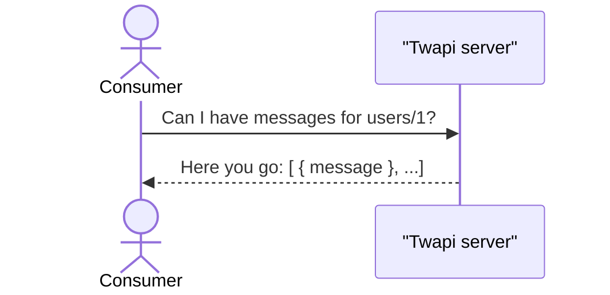

## 2.1 What are API design patterns?
API design patterns are simply blueprints for ways of designing and structuring APIs. While most API design patterns often remain silent on the underlying implementation, sometimes they dictate certain aspects of the API's behavior.

## 2.2 Why are API design patterns important?
Interfaces where users can easily accommodate changes are *flexible* and those where even small changes cause complete failures are *rigid.*

*Visibility* partly determines our ability to make changes to different kinds of interfaces, particularly rigid ones like APIs.

APIs are both rigid and difficult to change so relying on existing patterns that have survived the tests of time are valuable in getting things right the first time rather than just eventually as in most software.

## 2.3 Anatomy of an API design pattern
### 2.3.1 Name and synopsis
### 2.3.2 Motivation
### 2.3.3 Overview
### 2.3.4 Implementation
### 2.3.5 Trade-offs

## 2.4 Case study: Twapi, a Twitter-like API
### 2.4.1 Overview
With Twapi, our primary responsibility is to allow people to post new messages and view messages posted by other people.

### 2.4.2 Listing messages


#### With No Design Patterns
```typescript
abstract class Twapi {
	static version = "v1";
	static title = "Twapi API";

	@get("/{parent=users/*}/messages")
	ListMessages(req: ListMessagesRequest): ListMessagesResponse;
}

interface ListMessagesRequest {
  parent: string;
}

interface ListMessagesResponse {
  results: Message[];
}
```

As more and more people use the service, the list of messages can start to get pretty long.

#### Pagination Pattern
The pagination pattern is a way of retrieving a long list of items in smaller, more manageable chunks of data.

```typescript
abstract class Twapi {
	static version = "v1";
	static title = "Twapi API";

	@get("/{parent=users/*}/messages")
	ListMessages(req: ListMessagesRequest): ListMessagesResponse;
}

interface ListMessagesRequest {
  parent: string;
  pageToken: string;
  maxPageSize: number?;
}

interface ListMessagesResponse {
  results: Message[];
  nextPageToken: string;
}
```

#### What Happens If We Don't Start With The Pattern?
Why should I bother following this pattern from the start?

1. Previously written software has no way of finding data that shows up on subsequent pages.
2. Existing consumers are left with the impression that they've been given all the data.

### 2.4.3 Exporting data
Users of the Twapi service may want the ability to export all of their messages.
- We must consider that the amount of data we need to export might become pretty large.
- We should take into account that there may be lots of different storage systems on the receiving end of this data, and ideally we'd have a way to integrate with new ones as they become popular.
- There could be lots of different transformations we may want to apply to the data before exporting it.
- We need a way of expressing that there is some pending work (i.e., the actual exporting of the data) that is running in the background for the consumer to monitor the progress.

#### With No Design Patterns
When someone makes a request to this API, the response doesn't actually contain the data itself. Instead, it contains a point to where the data might be downloaded at some point in the future.

```typescript
abstract class Twapi {
	static version = "v1";
	static title = "Twapi API";

	@post("/{parent=users/*}/messages:export")
	ExportMessages(req: ExportMessagesRequest): ExportMessagesResponse;
}

interface ExportMessagesRequest {
	// The parent user of the messages to be exported.
	parent: string;
}

interface ExportMessagesResponse {
	// The location of a compressed file
	// containing the messages requested.
	exportDownloadUri: string;
}
```

- We have no way to define extra configuration about the data involved.
- We weren't able to choose the final destination of the data. We were simply told where we might go looking for it later.
- We have no way to monitor the progress of the export operation, nor a way to abort the operation.

#### Import/Export Pattern
This pattern will rely on others, such as the long-running operations pattern, to get the job done.

```typescript
abstract class Twapi {
	static version = "v1";
	static title = "Twapi API";

	@post("/{parent=users/*}/messages:export")
	ExportMessages(req: ExportMessagesRequest): Operation<ExportMessagesResponse,
			ExportMessagesMetadata>;
}

interface ExportMessagesRequest {
	// The parent user of the messages to be exported.
	parent: string;
	outputConfig: MessageOutputConfig;
}

interface MessageOutputConfig {
	destination: Destination;
	compressionConfig?: CompressionConfig;
	encryptionConfig?: EncryptionConfig;
}

interface ExportMessagesResponse {
	// The location of a compressed file
	// containing the messages requested.
	outputConfig: MessageOutputConfig;
}

interface ExportMessageMetadata {
	// An integer between 0 and 100
	// representing the progress of the operation.
	progressPercent: number;
}
```

- By relying on an encapsulated output configuration interface, we're able to accept the various parameters at request-time and then reuse this same content in our response back as confirmation to the consumer.
- Inside this configuration we're able to define several different configuration options.
- We're able to keep track of the progress of the export operation using the long-running operation's metadata information, which stores the progress of the operation as a percentage.

```typescript
interface Destination {
	typeId: string;
}

interface FileDestination extends Destination {
	// The uploaded file will be hosted on our servers.
	fileName: string;
}

interface AmazonS3Destination extends Destination {
	// This requires write access to the bucket
	// and object prefix granted to
	// AWS Account ID 1234-5678-1234.
	uriPrefix: string;
}

interface CompressionConfig {
	typeId: string;
}

interface GzipCompressionConfig extends CompressionConfig {
	// An integer value between 1 and 9.
	compressionLevel: number;
}

interface EncryptionConfig {
	// All sorts of encryption configuration here
	// can go here, or this can be
	// extended as CompressionConfig is.
}
```

The only thing left is to understand how exactly this long-running operation stuff actually works. For now, let's just throw out a simple API definition of these interfaces.

```typescript
interface OperationError {
	code: string;
	message: string;
	details?: any;
}

interface Operation<ResultT, MetadataT> {
	id: string;
	done: boolean;
	result?: ResultT | OperationError;
	metadata?: MetadataT;
}
```

#### What Happens If We Don't Start With The Pattern?
Two options differ significantly in the resulting API surface.

## Summary
- API design patterns are sort of like adaptable blueprints for designing and structuring APIs.
- API design patterns are important because APIs are generally very "rigid" and therefore not easy to change, so design patterns help minimize the need for large structural changes.
- Throughout this book, API design patterns will have several sections, including the name and summary, suggested rules, motivation, overview, implementation, and trade-offs of using the provided pattern over custom alternatives.
