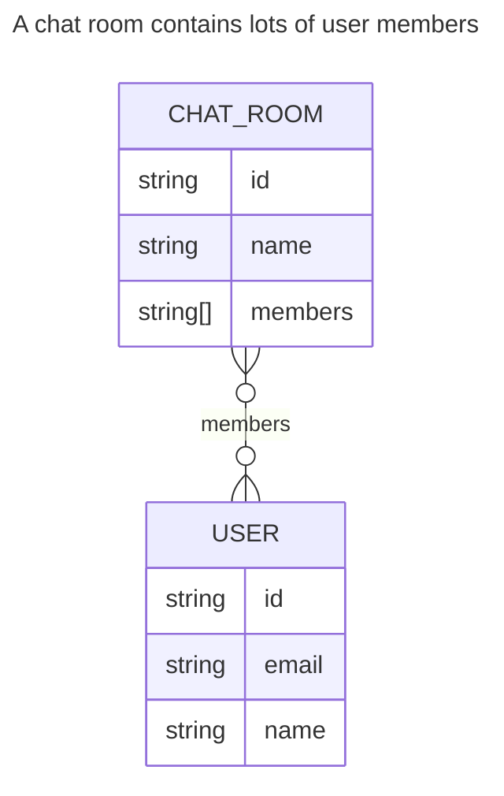
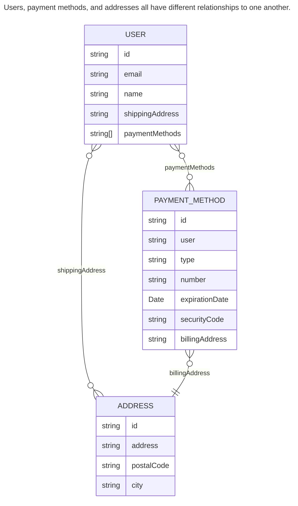
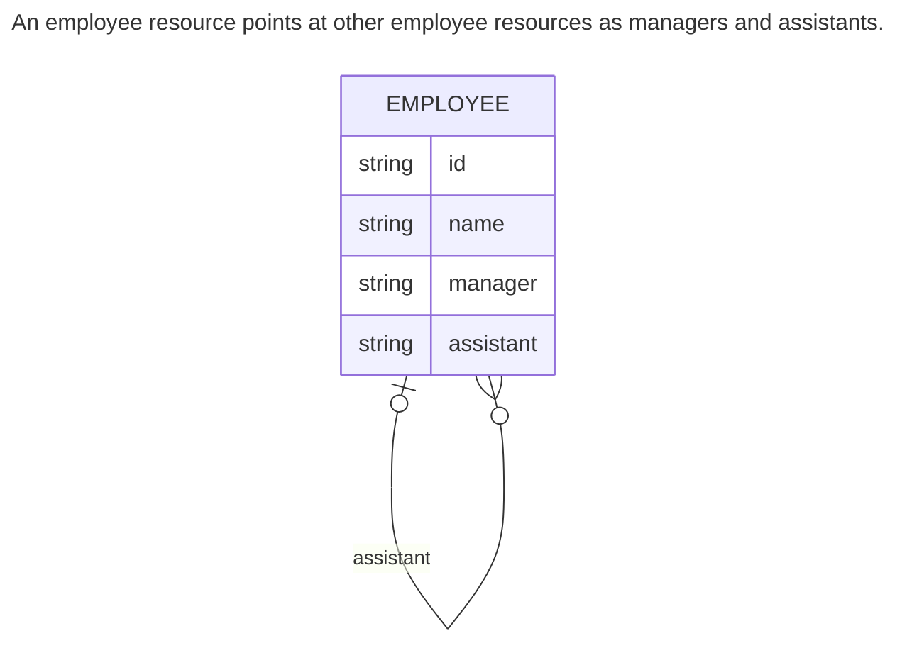

## 4.1 What is resource layout?
Resource layout is the entity (resource) relationship model for a particular design of an API.

### 4.1.1 Types of relationships
#### Reference Relationships
The simples way for two resources to relate to one another is by simple reference.

This reference relationship is sometimes referred to as a *foreign key* relationship.

#### Many-to-Many Relationships
A many-to-many relationship represents a scenario where resources are joined together in such a way that each resource points at multiple instances of the other.

#### Self-Reference Relationships
In this relationship a resource points to another resource of the exact same type.

Self-references are most frequently seen in hierarchical relationships where the resource is a node in a tree of in network-style APIs where the data can be represented as a directed graph.

#### Hierarchical Relationships
Hierarchies trend to reflect *containment* or *ownership* between resources.

### 4.1.2 Entity relationship diagrams
We can have arrows convey important information about the relationship. Each arrow can tell us *how many* resources might be on the other end.

## 4.2 Choosing the right relationship

### 4.2.1 Do you need a relationship at all?
Reference relationship should never be accidental, nice to have, or something you might need later on.

### 4.2.2 References or in-line data
We need to explore whether it makes sense to in-line that data in your API (i.e., store a duplicate copy inside a resource), or rely on a reference (i.e., keep just a pointer to the official data).

### 4.2.3 Hierarchy
Hierarchical relationships are special type of reference relationship between a parent resource and a child resource rather than two generally related resources. The biggest difference with this type of relationship are the cascading effect of actions and the inheritance of behaviors and properties from parent to child.

## 4.3 Anti-patterns
### 4.3.1 Resources for everything
A good rule of thumb here is to avoid two issues.
1. If you don't need to interact with one of your proposed resources independent of a resource it's associated with, then you might be fine with it being just a data type.
2. If the concept you're thinking of *is* something you might want to interact with directly, if it's able to be in-lined then that might be a good choice.

### 4.3.2 Deep hierarchies
Overly deep hierarchies can be confusing and difficult to manage for everyone involved.

### 4.3.3 In-line everything
Folding too much information into single resource can be just as detrimental as separating every piece of information apart into its own resource.

One big reason for this has to do with data integrity, which is also a common problem with de-normalized schemas in non-relational databases.

## 4.4 Exercises
## Summary
- Resource layout refers to the arrangement and relationships between resources in an API.
- While it might be tempting to connect every resource in an API, fight the urge and only store relationships if they provide important functionality to the API.
- Sometimes it makes sense to store a separate resource for a concept. Other times it's better to in-line that data and leave the concept as a data type. The decision depends on whether you need to atomically interact with that concept.
- Avoid overly deep hierarchical relationships as they can be difficult to comprehend and manage.
