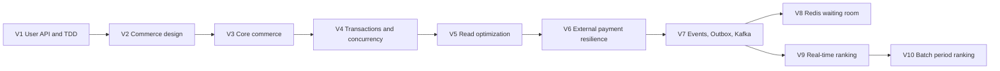
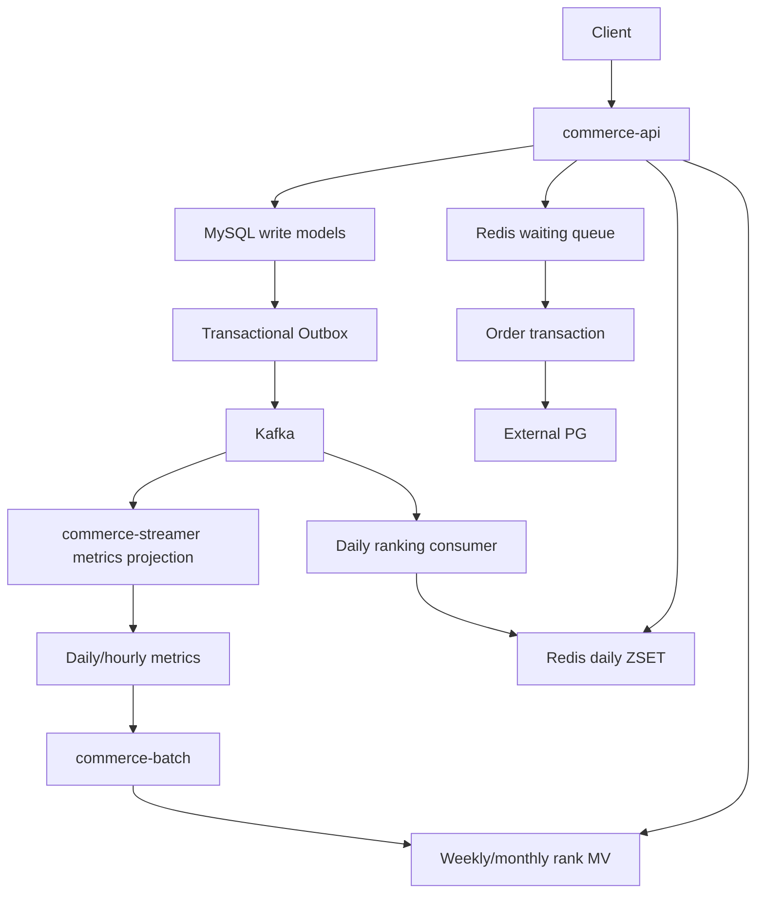

> [!summary]
> A structured reconstruction of the same ten-volume Loopers backend curriculum from the `loop-pack-be-l2-vol4-kotlin` PR history as of 2026-07-27, giving each volume a goal, functional scope, suggested implementation sequence, and verification criteria.
> Opens with an at-a-glance table and a Mermaid dependency graph showing how each volume enables the next — user APIs and TDD → commerce design → core commerce → transactions and concurrency → read optimization → external payment resilience → events/Outbox/Kafka → Redis waiting room → real-time ranking → Batch period ranking.
> Recurring requirements across participants are treated as the core assignment; the points where implementations diverge — locking strategy, cache shape, queue degradation policy, ranking weights, Batch job topology — are labeled design variants rather than requirements.

# Loopers Backend L2 Vol. 4: Volume 1–10 Reconstruction

Reconstructed from the pull-request history of
[`loopers-labs/loop-pack-be-l2-vol4-kotlin`](https://github.com/loopers-labs/loop-pack-be-l2-vol4-kotlin/pulls?page=1&q=)
on 2026-07-27.

## Scope and interpretation

The PR history ends with **Volume 10**. The last Volume 10 submissions were opened on
2026-07-23 and 2026-07-24; no Volume 11 PR appears in the repository history inspected.

This is a reconstruction rather than a verbatim course specification. The recurring
requirements across participants are treated as the core step. Choices that vary among
implementations—locking strategy, cache shape, queue degradation policy, ranking weights,
and Batch job topology—are labeled as design variants.

## The ten-volume progression at a glance

| Volume | Main problem | Principal deliverable | What it enables next |
|---|---|---|---|
| 1 | Establish a reliable user/API foundation | Registration, current-user lookup, password change, TDD | A working layered Spring application and test conventions |
| 2 | Design the commerce domain before coding it | Requirements, sequence diagrams, class diagram, ERD | Explicit domain and transaction boundaries |
| 3 | Turn the design into the commerce core | Brand, product, stock, like, order use cases | A real transactional business system |
| 4 | Preserve correctness under contention | Coupons, atomic order flow, concurrency control | Safe writes under concurrent demand |
| 5 | Make read-heavy APIs scale | Query measurement, indexes, denormalization/read model, cache | A measured high-throughput read path |
| 6 | Integrate an unreliable external PG | Async payment lifecycle, resilience, recovery, compensation | Safe interaction with an external system |
| 7 | Decouple side effects and scale event processing | Application events, Outbox, Kafka, idempotent consumers, limited coupons | Reusable event streams and projections |
| 8 | Protect the order path from traffic spikes | Redis virtual waiting room and entry tokens | Back-pressure before expensive order work |
| 9 | Build a real-time product ranking | Ranking consumer, Redis ZSET, ranking APIs, carry-over/snapshot | A real-time daily read model |
| 10 | Add durable weekly/monthly ranking | Spring Batch rollups, materialized views, unified period API | Rebuildable long-period analytics and ranking |

---

## Volume 1 — User management and TDD foundation

### Goal

Create the first complete vertical slice of the application and establish conventions for
layering, validation, error handling, persistence, and tests.

### Functional scope

The recurring API surface is:

- Register a user.
- Retrieve the authenticated user's information.
- Change the authenticated user's password.

Most submissions use versioned routes such as:

- `POST /api/v1/users`
- `GET /api/v1/users/me`
- `PATCH /api/v1/users/me/password`

Some use the same routes without `/v1`; the business requirement is the stable three-API
contract rather than one universally shared path spelling.

Authentication is intentionally primitive at this stage: credentials arrive in headers
such as `X-Loopers-LoginId` and `X-Loopers-LoginPw`. This is a learning scaffold, not a
production authentication design.

### Suggested implementation sequence

1. Write HTTP-contract tests for the successful and failing registration scenarios.
2. Define request/response DTOs and boundary validation for login ID, password, name,
   email, and birth date.
3. Put invariants that must hold regardless of transport inside the user model or value
   objects.
4. Introduce a `PasswordEncoder` port and a BCrypt adapter; never persist plaintext
   passwords.
5. Add a repository abstraction and JPA adapter with a unique database constraint on
   login ID.
6. Handle both the friendly pre-check and the final database uniqueness failure. The
   latter closes the race that a check-then-insert flow cannot close.
7. Centralize credential extraction, either with a reusable authentication service or a
   custom controller argument resolver.
8. Verify current-password matching and prohibit invalid or identical replacement
   passwords.
9. Map validation, unauthorized access, not-found users, and duplicate login IDs to
   consistent API errors.
10. Refactor only after the three RED → GREEN cycles reveal which abstractions earn
    their cost.

### Verification

- Domain or value-object tests for validation boundaries.
- Service/integration tests for password hashing, duplicate registration, authentication,
  and password transition.
- API/E2E tests for status codes and response contracts.
- A concurrent duplicate-registration test, with the database unique constraint as the
  final authority.

### Important design lesson

The PRs deliberately disagree on how much separation is appropriate. One approach uses
domain models, JPA entities, ports, and a custom argument resolver. Another removes
facades and extra DTO layers when their present cost exceeds their benefit. The common
lesson is to make responsibility explicit and let tests justify the chosen amount of
abstraction.

Sources: [PR #11](https://github.com/loopers-labs/loop-pack-be-l2-vol4-kotlin/pull/11),
[PR #14](https://github.com/loopers-labs/loop-pack-be-l2-vol4-kotlin/pull/14)

---

## Volume 2 — Commerce requirements and design

### Goal

Do not immediately code the commerce domain. First define what the system must do, which
objects own which rules, and where consistency boundaries lie.

### Deliverables

The clearest PR structure contains:

- `01-requirements.md`
- `02-sequence-diagrams.md`
- `03-class-diagram.md`
- `04-erd.md`

The design covers at least brand, product, stock/inventory, like, order, order item, user,
and a future payment boundary. Coupon concerns may be anticipated, but the full coupon
implementation belongs to Volume 4.

### Suggested design sequence

1. Write user and administrator requirements with happy paths and rejection rules.
2. Draw sequence diagrams for:
   - Product list and detail lookup.
   - Like registration and cancellation.
   - Order creation.
   - Insufficient inventory.
   - Payment failure and compensation.
3. Draw a class/domain diagram that assigns behavior instead of merely listing data.
4. Draw an ERD with uniqueness, foreign-key, snapshot, and deletion policies.
5. Reconcile all four documents so the same rule is not represented differently.
6. Record alternatives and trade-offs for the key boundaries below.

### Decisions that the PRs repeatedly examine

#### Product versus inventory

Keeping quantity in `Product` is simpler for the immediate scope. Separating
`ProductStock` or an inventory table gives stock its own lifecycle, narrows lock scope,
and makes reservation/recovery easier later. Either can be valid if the choice and
migration trigger are documented.

#### Order and payment boundary

Do not assume an external payment call can share database atomicity. A forward-looking
design is:

1. Local transaction: validate, reserve/deduct inventory, create a `PENDING` order.
2. External PG call outside the database transaction.
3. Local result transaction: mark success, or mark failure and compensate inventory and
   coupon state.

The unresolved `PENDING` state becomes an explicit recovery problem addressed in Volume 6.

#### Historical order data

Store product name and unit price on the order item as purchase-time snapshots. A later
product edit must not rewrite an old order.

#### Like count

Treat `likes` as the source of truth. A denormalized count can be updated synchronously,
after commit, or by a later projection, but the design must state the consistency delay
and recovery method.

#### Deletion

Brands and products often use soft deletion for traceability. Likes can use hard deletion
when preserving toggle history has little value. Unique-name reuse after soft deletion
requires an explicit database-safe policy.

### Acceptance criterion

Someone should be able to implement Volume 3 from the documents without inventing missing
transaction boundaries or state transitions.

Sources: [PR #20](https://github.com/loopers-labs/loop-pack-be-l2-vol4-kotlin/pull/20),
[PR #21](https://github.com/loopers-labs/loop-pack-be-l2-vol4-kotlin/pull/21),
[PR #24](https://github.com/loopers-labs/loop-pack-be-l2-vol4-kotlin/pull/24)

---

## Volume 3 — Core commerce implementation

### Goal

Implement the Volume 2 design as a working layered commerce application while keeping
business rules independently testable.

### Functional scope

- Brand administration and lookup.
- Product administration, list, and detail lookup.
- Stable list ordering such as latest, price ascending, and likes descending.
- Stock validation and deduction.
- Idempotent like registration/cancellation and a user's liked-product list.
- Order creation and lookup.
- Purchase-time order-item snapshots.
- An idempotency key or equivalent protection against duplicate order creation.

### Suggested implementation sequence

1. Define domain models and value types for IDs, money, quantity, state, and order lines.
2. Define repository ports before JPA adapters.
3. Implement JPA mappings and query repositories.
4. Put single-entity rules on the entity; use a stateless domain service for cooperation
   among multiple domain objects.
5. Use the application layer to load objects, establish the transaction boundary,
   orchestrate domain behavior, and persist results.
6. Keep controllers responsible for HTTP mapping rather than cross-domain business logic.
7. For an order:
   - Authenticate and validate the user.
   - Normalize or reject duplicate product lines.
   - Load products and inventory.
   - Validate all quantities before mutation.
   - Snapshot product name and price.
   - Deduct inventory.
   - Create and save the order atomically.
8. For likes, make repeat registration/cancellation harmless and define how the count
   projection changes.
9. For product queries, permit a read model to join across write-domain boundaries when
   required for database-side sorting and pagination.
10. Add unit, repository integration, use-case, and API tests.

### Important correctness detail

The order transaction must include managed entity loading, inventory mutation, and order
save. Several PRs found that a fake repository test could pass while a detached JPA entity
silently failed to flush the stock change. A real database integration test is therefore
part of the deliverable.

### Architectural variants

- Full hexagonal ports versus layered architecture with repository-level dependency
  inversion.
- A facade for every feature versus facades only for cross-domain orchestration.
- Inventory embedded in `Product` versus a dedicated stock model.

The shared invariant is more important than the package layout: application code owns
orchestration and transactions; domain code owns business decisions; infrastructure owns
storage mechanics.

Sources: [PR #33](https://github.com/loopers-labs/loop-pack-be-l2-vol4-kotlin/pull/33),
[PR #39](https://github.com/loopers-labs/loop-pack-be-l2-vol4-kotlin/pull/39),
[PR #48](https://github.com/loopers-labs/loop-pack-be-l2-vol4-kotlin/pull/48),
[PR #49](https://github.com/loopers-labs/loop-pack-be-l2-vol4-kotlin/pull/49)

---

## Volume 4 — Coupons, transaction atomicity, and concurrency

### Goal

Add coupons and prove that concurrent requests cannot oversell inventory, use one coupon
twice, or corrupt a like count.

### Functional scope

- Coupon template creation and administration.
- Fixed-amount and percentage discounts.
- Minimum order amount, validity period, and expiry.
- Coupon issuance to a user.
- User coupon states such as available and used.
- Optional coupon application during order creation.
- Correct `totalPrice`, `discountAmount`, and `paidPrice`.

### The atomic order flow

One local transaction should:

1. Authenticate the user.
2. Lock or otherwise protect the contested rows.
3. Validate inventory for every line.
4. Validate coupon ownership, availability, expiry, and minimum amount.
5. Calculate the discount and final amount.
6. Mark the coupon used.
7. Deduct inventory.
8. Save the order and item snapshots.
9. Roll everything back if any step fails.

Acquire multiple inventory rows in deterministic product-ID order to reduce deadlock
probability.

### Resource-specific concurrency strategies

The PRs show that one lock type need not fit every resource:

| Resource | Common strong choice | Reason |
|---|---|---|
| Inventory | Pessimistic write lock | Hot-row contention and overselling must be prevented before commit |
| User coupon | Optimistic `@Version` or pessimistic lock | Optimistic suits rare duplicate attempts; pessimistic makes the flow simpler |
| Like count | Atomic SQL increment/decrement | It is a commutative counter and does not require read-modify-write |
| Coupon issuance capacity | Unique/conditional database update | The database remains the final limit authority |

Coupon template values may either be referenced live or copied to the issued coupon.
Snapshotting preserves the exact promise made at issue time; referencing the template is
simpler but permits later template edits to affect issued coupons.

### Verification

Use MySQL/Testcontainers rather than only in-memory fakes:

- N concurrent orders for stock S produce exactly S successes and never negative stock.
- Concurrent use of one issued coupon produces exactly one success.
- Concurrent likes/unlikes preserve the correct count.
- An invalid coupon after stock inspection changes nothing.
- Insufficient stock after coupon inspection changes nothing.
- A forced persistence failure rolls back order, inventory, and coupon together.

Sources: [PR #57](https://github.com/loopers-labs/loop-pack-be-l2-vol4-kotlin/pull/57),
[PR #59](https://github.com/loopers-labs/loop-pack-be-l2-vol4-kotlin/pull/59),
[PR #61](https://github.com/loopers-labs/loop-pack-be-l2-vol4-kotlin/pull/61),
[PR #62](https://github.com/loopers-labs/loop-pack-be-l2-vol4-kotlin/pull/62)

---

## Volume 5 — Evidence-driven read optimization

### Goal

Improve product-list and product-detail performance by measuring the current bottleneck,
changing the data/query shape, and only then adding cache where justified.

### Suggested implementation sequence

1. Create representative data: approximately 100,000–300,000 products and a larger,
   skewed like population.
2. Record baseline latency, throughput, p95/p99, error rate, rows examined, and connection
   pool behavior.
3. Run `EXPLAIN ANALYZE` for each real query pattern:
   - Global latest.
   - Brand-filtered latest.
   - Global/brand price order.
   - Global/brand likes order.
4. Add composite indexes matching equality predicates first and stable ordering columns
   next. Include a deterministic ID tie-breaker with a direction compatible with the main
   sort.
5. Re-measure. Do not assume an index helps: one PR observed a worse plan after the
   optimizer changed join strategy.
6. Remove aggregate sorting from the request path:
   - Variant A: maintain `products.like_count` with atomic updates.
   - Variant B: maintain a `product_like_count` read model/materialized-view table and
     refresh it out of band.
7. Ensure the query starts from the table whose index can satisfy the target ordering.
8. Add caching only after the database path is understood.
9. Load test again under concurrency and compare pool queueing, p99, throughput, and
   errors—not just a warm single-query time.

### Cache design reconstructed from the PRs

- Use cache-aside for product detail or clearly hot list pages.
- Use write-around plus eviction for mutations.
- Treat a Redis read failure as a cache miss when the database remains a valid fallback.
- Cache stable product/brand information, but calculate user-specific `likedByMe` per
  request.
- Be cautious about caching live inventory or `soldOut`.
- Use shorter TTL for high-change list order and longer TTL for stable entities.
- Add TTL jitter and/or single-flight rebuilding to control stampedes.
- Perform eviction after transaction commit to avoid repopulating an uncommitted old
  value.
- An L1 local cache can remove network cost for highly stable data, but creates
  cross-instance stale windows.

### Representative results, not universal targets

One PR reduced latest-list lookup from 118 ms to 0.065 ms with indexing and cache hits to
about 0.1 ms. Another moved a 500-VU likes-order workload from 27.7 to 975 RPS and p99 from
18.56 s to 1.01 s using a read model plus layered cache. These values demonstrate the
measurement method; they are not course-wide acceptance thresholds.

### Remaining structural limits

- Offset pagination still degrades at deep pages; keyset/cursor pagination is the next
  step.
- Denormalized counters require drift repair.
- A cache hides but does not repair an expensive cache-miss path.

Sources: [PR #67](https://github.com/loopers-labs/loop-pack-be-l2-vol4-kotlin/pull/67),
[PR #70](https://github.com/loopers-labs/loop-pack-be-l2-vol4-kotlin/pull/70),
[PR #73](https://github.com/loopers-labs/loop-pack-be-l2-vol4-kotlin/pull/73),
[PR #83](https://github.com/loopers-labs/loop-pack-be-l2-vol4-kotlin/pull/83)

---

## Volume 6 — External PG integration and resilience

### Goal

Replace the always-successful internal payment stub with the PG simulator and design for
latency, rejection, timeout, unknown outcomes, duplicate callbacks, and recovery.

### Core lifecycle

1. Validate the order and create a local `PENDING`/`REQUESTED` payment in a short
   transaction.
2. Commit before calling the external PG.
3. Send the PG request with an order-scoped idempotency key.
4. Record an accepted transaction key when received.
5. Return a pending result; final payment processing is asynchronous.
6. Receive a callback and/or poll stale payments.
7. Apply the terminal outcome with a compare-and-set transition so callback and poll
   cannot both finalize it.
8. On failure, update payment/order state and restore inventory/coupon in one local
   transaction.

### Resilience policy

#### Timeouts

Set connect and read timeouts from the simulator's expected latency and the service's
latency budget. A timeout means “outcome unknown,” not necessarily “payment failed.”

#### Retry

Retry only transient transport/5xx failures and only when the PG request is idempotent.
Exclude 4xx/business rejection. Use bounded exponential backoff with jitter.

Some PRs intentionally omit blind retry for payment creation because an accepted request
whose response was lost could otherwise become a double charge. That is a valid stricter
variant.

#### Circuit breaker

Count only failures that indicate PG health. Place the breaker outside the retry block
when one user request should contribute one final breaker event. Keep:

`normal latency < slow-call threshold < timeout`

so slow-call telemetry has meaning.

#### Fallback and state machine

Persist uncertainty explicitly as `UNKNOWN`, or leave a payment `PENDING` with recovery
metadata. Do not convert a timeout directly to `FAILED`.

Useful states across the PRs include:

- `PENDING` / `REQUESTED`
- `APPROVED`
- `FAILED`
- `UNKNOWN`
- `UNRESOLVED`
- `REFUND_REQUIRED`

The exact names vary; the essential property is that uncertainty and terminal failure are
different.

### Recovery and security

- Reconcile by `orderId` when timeout occurred before a transaction key was received.
- Track poll attempts and last-polled time.
- Quarantine an outcome that cannot safely be inferred instead of compensating blindly.
- Validate callback transaction key, order ID, and amount.
- Protect callbacks with an authenticated secret where the simulator permits it.
- Keep callback URL and resilience values in configuration.

### Verification

Use deterministic PG stubs/WireMock plus integration tests:

- Timeout becomes unknown/pending and is later reconciled.
- 4xx is not retried.
- Transient failure obeys the bounded retry policy.
- An open circuit fails quickly.
- Duplicate callback is a no-op.
- Callback and polling race produce one terminal transition.
- Compensation is atomic and repeat-safe.
- Amount/order mismatch is rejected.

Sources: [PR #90](https://github.com/loopers-labs/loop-pack-be-l2-vol4-kotlin/pull/90),
[PR #94](https://github.com/loopers-labs/loop-pack-be-l2-vol4-kotlin/pull/94),
[PR #99](https://github.com/loopers-labs/loop-pack-be-l2-vol4-kotlin/pull/99)

---

## Volume 7 — EDA, Transactional Outbox, Kafka, and limited coupons

### Goal

Separate secondary work from the core request path and create a reliable event pipeline
that assumes loss risks, duplication, reordering, consumer failure, and replay.

### Step 1: internal application-event boundary

Publish facts such as:

- Product viewed.
- Like count changed.
- Order paid/payment succeeded.

Keep inventory, coupon use, order state, and payment state in their required synchronous
transaction. Move logging, notification, and derived metrics to event handlers where
their failure should not roll back the core operation.

### Step 2: reliable external event publication

Use a Transactional Outbox:

1. In the same database transaction as the business state change, insert an outbox row
   with a single generated `eventId`, type/version, aggregate type/ID, payload, and status.
2. A relay claims pending rows.
3. The relay publishes with a stable Kafka key and waits for broker acknowledgment.
4. Mark success, or record failure/retry time without blocking all later rows.

The strongest atomicity design writes the outbox before the business transaction commits.
Some submissions use `AFTER_COMMIT` plus `REQUIRES_NEW`; that decouples failure but leaves
a crash window between the business commit and outbox insert, so it is not equivalent to
an atomic Transactional Outbox.

High-volume, low-value view events may deliberately use best-effort direct publication.
The reliability class should be an explicit event-level decision.

### Step 3: independent consumers and projections

- `commerce-streamer` consumes catalog/order topics.
- Maintain `product_metrics` as a derived projection, not a source of truth.
- Use separate consumer groups for metrics, ranking, or other projections.
- Partition by the entity whose order matters: typically product ID, order ID, or coupon
  ID.
- Store an inbox/handled-event record and update the projection in the same transaction.
- Ack only after commit.
- Route poison records through bounded retries into a correctly partitioned DLT.

### Step 4: asynchronous first-come coupon issuance

1. The API accepts a request and returns a request ID/PENDING state.
2. Persist the request and its outbox event.
3. Key Kafka messages by coupon ID so one coupon's requests preserve order.
4. The consumer performs a conditional atomic capacity update and inserts the user's
   coupon.
5. Store `ISSUED`, `SOLD_OUT`, `DUPLICATE`, or `FAILED` for polling.
6. Enforce both event-level idempotency and `(couponId, userId)` uniqueness.

Some PRs add a Redis Lua pre-gate to reject obvious sold-out/duplicate traffic before
Kafka, while retaining the database conditional update and unique key as final truth.

### Verification

- Business state and outbox row commit or roll back together.
- Re-publishing the same event changes a projection once.
- Consumer crash after database commit but before ack is harmless.
- A poison event reaches DLT without blocking the partition forever.
- A 100-slot coupon under hundreds or thousands of requests issues exactly 100.
- Outbox backlog, failed rows, consumer lag, dedup hits, and DLT volume are observable.

Sources: [PR #101](https://github.com/loopers-labs/loop-pack-be-l2-vol4-kotlin/pull/101),
[PR #107](https://github.com/loopers-labs/loop-pack-be-l2-vol4-kotlin/pull/107),
[PR #108](https://github.com/loopers-labs/loop-pack-be-l2-vol4-kotlin/pull/108),
[PR #111](https://github.com/loopers-labs/loop-pack-be-l2-vol4-kotlin/pull/111)

---

## Volume 8 — Redis virtual waiting room

### Goal

Prevent a traffic spike from reaching order transactions, the database connection pool,
and PG faster than those systems can safely process it.

### Core data model

Use a Redis Sorted Set:

- Member: user/account ID.
- Score: monotonic sequence or entry timestamp.
- `ZADD NX`: idempotent entry.
- `ZRANK + 1`: 1-based queue position.
- `ZPOPMIN N`: ordered admission.

Expose:

- Enter queue.
- Get current position and estimated wait.
- Receive or retrieve an entry token.
- Place a limited-product order using that token.

### Admission flow

1. A user enters once and receives the existing position on repeat entry.
2. A scheduler/admission worker calculates the safe number to admit.
3. Pop the oldest users.
4. Create user-token bindings with a TTL.
5. The order gate atomically claims/reserves a valid token.
6. Run the existing Volume 7 order/outbox flow.
7. Consume the token after a committed order, or release it after a proven rollback.
8. Use `(userId, idempotencyKey)` to resolve timeout ambiguity and repeat attempts.

Use Lua when a transition touches the queue, token maps, and status together. A token
state machine such as `ACTIVE → PROCESSING → CONSUMED` makes recovery explicit.

### Admission-rate variants

- Fixed batch/leaky-bucket admission gives smooth constant output.
- Token bucket permits a bounded burst after idle time while enforcing an active-capacity
  ceiling.

One PR derives an example safe rate from a 50-connection pool and 200 ms order time, then
applies a safety margin. The method—derive from measured downstream capacity—is the core
requirement; the number is not universal.

### Failure policy is a product decision

The PRs intentionally differ:

- **Fail-open:** bypass the queue when Redis is unavailable, preserving availability but
  exposing the database to the spike.
- **Fail-closed:** return `503`, preserving fairness and downstream safety but making the
  queue a hard dependency.

Choose one explicitly, keep the fallback decision above the Redis adapter, and alert on
degraded operation. A silent fallback to a second queue store creates split authority and
is usually worse.

### Verification

- Hundreds of simultaneous entries produce unique contiguous ranks.
- Re-entry does not move the user backward.
- Admission never exceeds active capacity.
- Token expiry, claim, consume, release, and repeat calls are deterministic.
- Two concurrent orders cannot spend one token twice.
- A committed order followed by a lost Redis response is recovered through idempotency.
- Redis failure produces the documented fail-open or fail-closed result.
- Queue depth, admission rate, wait estimate, token expiry, and Redis latency are
  observable.

Sources: [PR #120](https://github.com/loopers-labs/loop-pack-be-l2-vol4-kotlin/pull/120),
[PR #122](https://github.com/loopers-labs/loop-pack-be-l2-vol4-kotlin/pull/122),
[PR #125](https://github.com/loopers-labs/loop-pack-be-l2-vol4-kotlin/pull/125)

---

## Volume 9 — Real-time daily product ranking

### Goal

Turn the Volume 7 behavior events into a fresh, high-read-volume ranking without running
an RDB aggregation and sort for every request.

### Event and score pipeline

1. Subscribe to like, payment/order, and optionally view events with a dedicated ranking
   consumer group.
2. Derive the board date from the event occurrence timestamp in `Asia/Seoul`, not the
   consumer's current time.
3. Map each event to one or more `(productId, scoreDelta)` changes.
4. Atomically deduplicate and apply the score in Redis.
5. Keep metrics and ranking consumers independent so a ranking outage does not block the
   durable metrics projection.

### Scoring policy

The submissions use different formulas:

- Likes `+1`, cancellation `-1`, successful purchase `+4`, views excluded.
- Weighted view/like/order signals.
- Price-aware purchase score normalized with `log10` to prevent a high-price order from
  dominating all engagement.

The recurring requirement is that a real purchase be a stronger signal than several
likes, cancellations reverse their contribution, and the policy live in one reusable
component. Do not present any one participant's weights as canonical.

### Redis ranking model

A typical daily key is:

`ranking:all:v1:{yyyyMMdd}`

Use:

- `ZINCRBY` or absolute `ZADD` for score updates.
- `ZREVRANGE` for Top-N/page IDs.
- `ZREVRANK + 1` for ordinal position, or `ZCOUNT(score, +inf) + 1` when tied items must
  share competition rank.
- An absolute expiry tied to the board date, rather than extending a rolling TTL on every
  event.

For at-least-once Kafka delivery, combine `SET NX` deduplication, score mutation, and TTL
setup in one Lua operation when exact projection behavior matters. For multi-product
orders, use `(eventId, productId)` as the replay unit.

An alternative architecture uses RDB daily metrics as the source of truth and overwrites
the Redis member with the latest absolute total. This simplifies Redis rebuilding. Both
approaches require an explicit recovery source.

### Serving APIs

- `GET /api/v1/rankings?date=yyyyMMdd&page=0&size=20`
- Optional `period=DAILY|HOURLY`
- Product detail includes today's 1-based rank or `null`.

Read ordered product IDs first, bulk-load products/brands/like information, and rebuild
the response in the original ranking order. Exclude deleted/inactive products.

Do not freeze the current rank inside a long-lived product cache. Rank can be attached
after the stable product response is loaded. On product detail, `rank = null` is a useful
graceful-degradation policy because product information is primary and rank is secondary.

### Midnight continuity and durability

Daily boards otherwise start empty. The PRs use a decayed carry-over:

1. Before midnight, snapshot or read the current board.
2. Pre-create the next day's board with a fraction of the previous score.
3. Use a marker/state key so multiple instances cannot carry over twice.
4. Account for events arriving during or after the cutoff.
5. Keep a short-lived previous board and/or an RDB Top-N snapshot for history and recovery.

Carry-over factors vary (for example 10% or 50%). The invariant is controlled decay and
idempotent transition, not one mandatory factor.

### Verification

- Duplicate event changes the score once.
- Like cancellation subtracts correctly.
- Multi-item order partially replayed completes only missing items.
- A late event is assigned to its occurrence date.
- Invalid calendar dates are rejected strictly.
- TTL does not drift with later writes.
- Carry-over is decayed and idempotent.
- Redis failure leaves the metrics pipeline healthy.
- Ranking list preserves Redis order after product aggregation.
- Product detail returns live rank or `null`.

Sources: [PR #129](https://github.com/loopers-labs/loop-pack-be-l2-vol4-kotlin/pull/129),
[PR #135](https://github.com/loopers-labs/loop-pack-be-l2-vol4-kotlin/pull/135),
[PR #138](https://github.com/loopers-labs/loop-pack-be-l2-vol4-kotlin/pull/138),
[PR #139](https://github.com/loopers-labs/loop-pack-be-l2-vol4-kotlin/pull/139),
[PR #140](https://github.com/loopers-labs/loop-pack-be-l2-vol4-kotlin/pull/140)

---

## Volume 10 — Spring Batch weekly/monthly ranking

### Goal

Keep daily ranking real-time, but make weekly and monthly ranking durable, rebuildable,
restartable, and cheap to serve.

### Choose the correct aggregation source

Do not sum daily Top-N snapshots:

- Products outside each day's cutoff disappear.
- Carry-over would be counted as new behavior again.

Do not use a lifetime `product_metrics` row with no time dimension; it cannot reconstruct
a particular week or month.

Store raw daily or hourly metrics by product and occurrence date/time:

- View count.
- Like net change.
- Order count/quantity.
- Optionally the ranking score delta when the score cannot be reconstructed from counts.

Keep carry-over out of weekly/monthly business signals.

### Batch topology

A robust reconstruction is:

1. Validate job parameters such as `periodStart`, `targetDate`, period type, and rebuild
   version.
2. Compute ISO-week and calendar-month half-open ranges.
3. Clean only the staging area for this job/period.
4. Stream grouped metrics with a JDBC cursor or paging reader.
5. Process into product-period scores.
6. Write chunks to staging.
7. Rank by score descending with a deterministic product-ID tie-breaker.
8. Publish only Top 100.
9. Replace or publish the completed materialized view in one short transaction or
   generation switch.
10. Expose the new generation only after the job succeeds.

One detailed implementation uses six steps:

1. Weekly clean.
2. Weekly aggregate.
3. Weekly rank.
4. Monthly clean.
5. Monthly aggregate.
6. Monthly rank.

Another uses staging followed by one atomic publish step for each period. The latter most
directly prevents partial Chunk output from becoming visible.

### Reader choice

- `JdbcCursorItemReader`: executes one `GROUP BY product_id` query and streams its result,
  avoiding repeated range aggregation but holding a connection longer.
- `JdbcPagingItemReader`: easier page checkpoints, but can repeat expensive range/group
  work and incur offset cost.
- A Tasklet with one database aggregation/replace statement: simplest and naturally
  idempotent at small scale, but does not demonstrate full Chunk restart behavior.

The assignment's recurring intent is parameterized Spring Batch plus chunk-aware
processing and restart/idempotency reasoning. Choose the reader from the measured query
shape.

### Idempotency and restart

- Do not increment yesterday's contribution into the MV without a ledger; retries would
  double count.
- Prefer recomputing the complete target period and replacing it.
- Separate cleanup from a Chunk step. If cleanup reruns during a mid-step restart, it can
  delete chunks already committed before the failure.
- Use meaningful job identity such as `(periodStart, rebuildVersion)`.
- A successful identical instance should not rerun accidentally.
- A deliberate correction increments `rebuildVersion`.
- A failed instance resumes from completed chunks/steps.

### Unified API

Extend the ranking endpoint:

`GET /api/v1/rankings?period=DAILY|WEEKLY|MONTHLY&date=yyyyMMdd&page=0&size=20`

- Missing period remains `DAILY` for backward compatibility.
- Daily uses the existing Redis/snapshot path.
- Weekly uses a weekly MV.
- Monthly uses a monthly MV.
- Normalize a weekly date to its Monday and a monthly date to its first day.
- Reuse the existing ordered product/brand response assembly.

The MV may be two tables (`mv_product_rank_weekly/monthly`) or one table partitioned by
`period_type` and `period_key`. Both appear in the PRs.

### Verification

- Missing/malformed job parameters fail before processing.
- ISO week across year-end and month boundaries is correct.
- Same period/rebuild input does not duplicate rows or score.
- Intentional rebuild replaces the prior result.
- Failure after several chunks restarts without losing committed progress.
- Publish failure leaves the previous complete board visible.
- Deleted products are excluded.
- Top 100 cutoff is exact.
- Ties have deterministic ordering.
- Daily API behavior is unchanged.
- Weekly/monthly E2E responses preserve ranking order and pagination.

Sources: [PR #141](https://github.com/loopers-labs/loop-pack-be-l2-vol4-kotlin/pull/141),
[PR #144](https://github.com/loopers-labs/loop-pack-be-l2-vol4-kotlin/pull/144),
[PR #146](https://github.com/loopers-labs/loop-pack-be-l2-vol4-kotlin/pull/146),
[PR #147](https://github.com/loopers-labs/loop-pack-be-l2-vol4-kotlin/pull/147),
[PR #149](https://github.com/loopers-labs/loop-pack-be-l2-vol4-kotlin/pull/149)

---

## The resulting system after Volume 10

The course progression is cumulative:

- Volumes 1–3 establish functional correctness and boundaries.
- Volume 4 makes writes correct under concurrency.
- Volume 5 makes reads efficient under load.
- Volume 6 handles an unreliable external dependency.
- Volume 7 makes asynchronous side effects reliable and replayable.
- Volume 8 adds back-pressure.
- Volume 9 builds a real-time projection from the event stream.
- Volume 10 turns time-bucketed projection data into durable period views.

That dependency chain is the central reconstructed curriculum, even where individual PRs
choose different implementation tactics.
