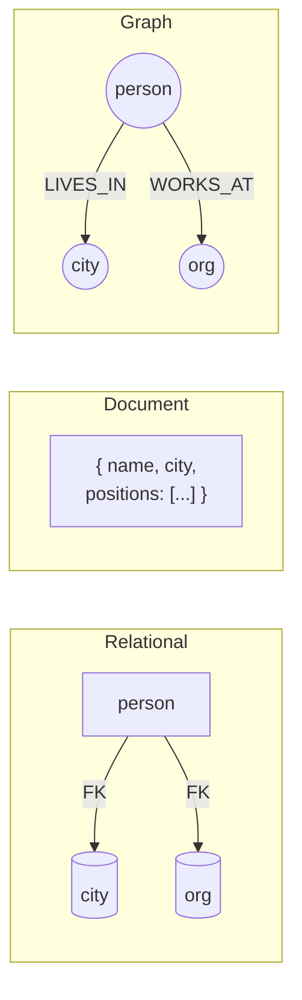

# Data Models & Query Languages

Chapter 3 · _Designing Data-Intensive Applications_, 2nd ed.

<div class="opacity-60 text-sm mt-4">
Kleppmann &amp; Riccomini — study deck distilled from Cornell notes
</div>

<!--
Speaker note: this is where the DENSE prose from your Cornell notes lives —
off the slide, in your hand. Press `p` in the dev server for presenter mode.
-->

---
layout: section
---

# Relational vs. Document

Where each model wins, and where it hurts

---
layout: two-cols
layoutClass: gap-12
---

# Relational

<v-clicks>

- Joins are **first-class** — many-to-one and many-to-many are cheap
- **Schema-on-write**: structure enforced up front
- Normalization removes duplication
- Query planner optimizes access paths for you

</v-clicks>

::right::

# Document

<v-clicks>

- **Locality**: the whole tree loads in one read
- **Schema-on-read**: flexible, evolves with the app
- Great for **one-to-many** trees (a résumé, an order)
- Many-to-many forces app-side joins → pain

</v-clicks>

<!--
The cue/answer pairs from your Cornell table map cleanly onto two columns.
This is the slide you'll reach for most in DDIA — every chapter is trade-offs.
-->

---

# The same data, three ways

The model is a lens, not a truth — sketch the data before you pick one.



<div class="text-sm opacity-60 mt-2">
Mermaid renders natively in Slidev — no plugin, no pre-rendered SVG.
</div>

---

# Trade-offs at a glance

| Dimension | Relational | Document | Graph |
| --- | --- | --- | --- |
| Many-to-many | ✅ joins | ⚠️ app-side | ✅✅ native |
| Locality | ⚠️ scattered | ✅ one read | ⚠️ traversal |
| Schema | on-write | on-read | flexible |
| Evolving relationships | rigid | awkward | ✅ natural |

<v-click>

> **Through-line:** there is no "best" model — pick the one whose _native_
> operation matches your dominant access pattern.

</v-click>

---

# Querying a graph in SQL is awkward

Recursive CTEs work, but compare the ceremony to a Cypher traversal.

```sql {1|2-6|7-10|all}
WITH RECURSIVE in_europe(country) AS (
    SELECT name FROM places
    WHERE type = 'continent' AND name = 'Europe'
  UNION
    SELECT places.name FROM places
    JOIN in_europe ON places.within = in_europe.country
)
SELECT person.name FROM person
JOIN in_europe ON person.born_in = in_europe.country;
```

<v-click>

In Cypher: `MATCH (p)-[:BORN_IN]->()-[:WITHIN*0..]->(:Continent {name:'Europe'})`

</v-click>

---
layout: center
class: text-center
---

# Takeaways

<v-clicks>

- Data model choice ripples through the whole stack
- **Joins** sit at the center of the relational/document trade-off
- Reach for **graphs** when relationships are the data
- The model is a lens — sketch the data first, decide second

</v-clicks>

<div class="abs-br m-6 text-sm opacity-50">
← → to navigate · <kbd>o</kbd> overview · <kbd>p</kbd> presenter
</div>
