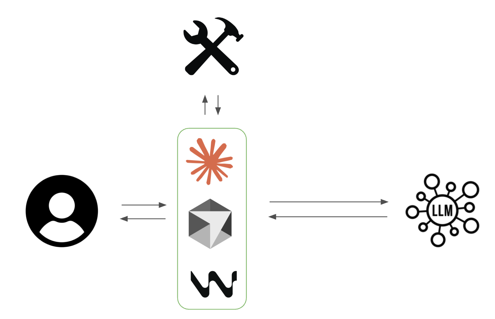

> [!summary]
> Notes on the fundamentals of coding agents, covering how modern tools like Claude Code work internally: reading terminal input, providing tool-use capabilities (file reading, editing, directory listing), and executing tools offline in an agentic loop. The key advice is to treat every repeated task as something an agent can automate.

## How to succeed in this class
- Treat every task you do repeatedly as something an agent can do
- Always spend 10 minutes experimenting with a tool on a new task

## How Modern Coding Agents Work
[How Modern Coding Agents Work](https://docs.google.com/presentation/d/1IUGPWxhqHtQy8hviwvAWb4WXQ8hMm5C2LNvbIpzotYs/edit?slide=id.g379fd9a61ab_0_0#slide=id.g379fd9a61ab_0_0)

### Internals of Claude Code

#### Steps
- Read from terminal and keep appending to conversation
- Tell LLM what tools are available
	- LLM asks for tool use at appropriate time
	- Execute tool offline and return response
		- "Read_file"
		- "List_dir"
		- "Edit_file"
- Create new file, edit file, etc.
